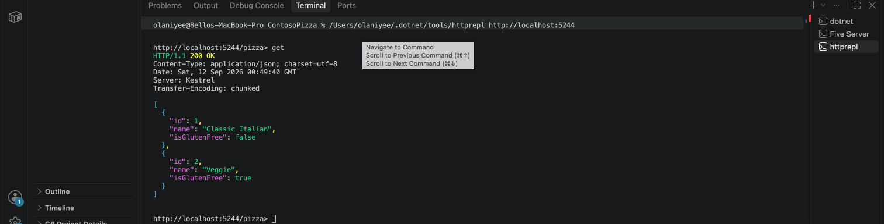
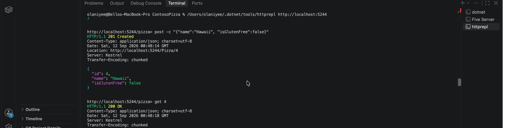

# W01 Assignment

## Part 1: Create a web API with ASP.NET Core controllers

**Existing records:** The GET request returns `200 OK` and shows Classic Italian (ID 1, not gluten-free) and Veggie (ID 2, gluten-free).



**Additional record:** Hawaii (ID 4, `isGlutenFree: false`). The POST request returns `201 Created`, and the subsequent GET request for ID 4 returns `200 OK`.



## Part 2: Sales summary function

`GenerateSalesSummary` writes `salesTotalDir/sales-summary.txt` with the overall sales total and each file's sales total. Relative file paths distinguish files in different store folders. Currency formatting uses the system locale.

The following code is copied from `Program.cs`, including the helper function and data record. It uses `System.Text` and the project's `Newtonsoft.Json` package.

```csharp
using System;
using System.Collections.Generic;
using System.IO;
using System.Text;
using Newtonsoft.Json;

double CalculateSalesTotal(IEnumerable<string> salesFiles)
{
    double salesTotal = 0;

    // Loop over each file path in salesFiles
    foreach (var file in salesFiles)
    {
        // Read the contents of the file
        string salesJson = File.ReadAllText(file);

        // Parse the contents as JSON
        SalesData? data = JsonConvert.DeserializeObject<SalesData?>(salesJson);

        // Add the amount found in the Total field to the salesTotal variable
        salesTotal += data?.Total ?? 0;
    }

    return salesTotal;
}

void GenerateSalesSummary(IEnumerable<string> salesFiles, string storesDirectory, string reportPath)
{
    var details = new StringBuilder();
    double totalSales = 0;

    foreach (var file in salesFiles)
    {
        var fileTotal = CalculateSalesTotal(new[] { file });
        totalSales += fileTotal;

        // Include the store folder to distinguish files with the same name.
        var fileName = Path.GetRelativePath(storesDirectory, file);
        details.AppendLine($" {fileName}: {fileTotal:C}");
    }

    var report = new StringBuilder();
    report.AppendLine("Sales Summary");
    report.AppendLine("----------------------------");
    report.AppendLine($" Total Sales: {totalSales:C}");
    report.AppendLine();
    report.AppendLine(" Details:");
    report.Append(details);

    File.WriteAllText(reportPath, report.ToString());
}

record SalesData(double Total);
```

The application calls the function after finding the sales files and creating the output directory:

```csharp
GenerateSalesSummary(salesFiles, storesDirectory, Path.Combine(salesTotalDir, "sales-summary.txt"));
```
